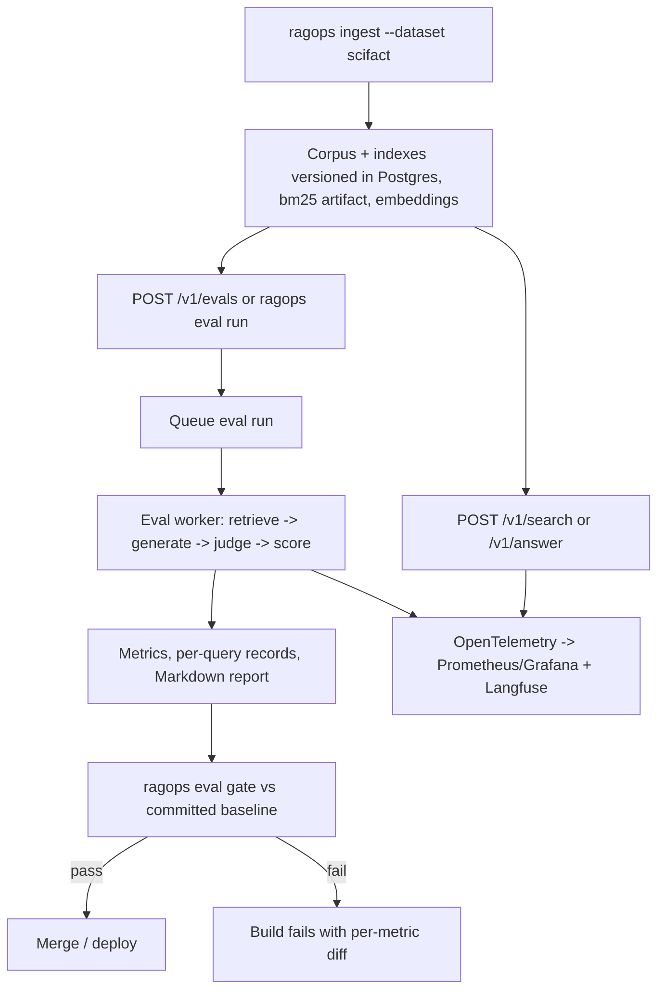

# RAG Evaluation & Observability Platform

## 1. Executive summary

This document defines a retrieval-augmented generation (RAG) service whose primary product is **measurement**, not search. The system indexes public information-retrieval benchmarks, serves several swappable retrieval strategies behind one API, answers questions with cited context, and continuously scores retrieval quality, answer quality, latency, and cost. Every change to a retriever, prompt, or model runs against a fixed benchmark in CI and fails the build when quality regresses beyond a declared threshold.

The platform exists to make one portfolio claim unmistakable: the author can make probabilistic LLM behavior measurable, observable, and safely deployable inside deterministic software boundaries. It complements the existing `deep-research` repository, which demonstrates agent orchestration, durable AWS workflows, and security controls but has no quantified evaluation, no telemetry dashboards, no container image, and no CI. The evaluation harness built here is deliberately generic so a later phase can point it at `deep-research` and give the flagship project a benchmark table of its own.

Retrieval variants ship in four tiers: sparse (BM25), dense (sentence-transformer embeddings in pgvector), hybrid (reciprocal rank fusion of the two), and hybrid plus cross-encoder reranking. Generation uses Claude by default with a provider-neutral interface. Evaluation combines deterministic metrics computed from benchmark relevance judgments with a validated LLM-as-judge for answer faithfulness and relevance. Telemetry flows through OpenTelemetry to Prometheus and Grafana for service health and to a self-hosted Langfuse instance for LLM traces, token cost, and judge scores.

Development is local-first with a one-command Docker Compose demo. The production path deploys the API and evaluation worker to Amazon ECS on Fargate with RDS Postgres, S3, and CloudWatch through Terraform, authenticated from GitHub Actions with OpenID Connect rather than long-lived keys.

### Goals

- Report retrieval quality (nDCG@10, Recall@10, Recall@100, MRR@10) for every variant on three public benchmark datasets from different domains.
- Report answer quality (faithfulness, answer relevance, citation validity, correct abstention) with a judge whose agreement with human labels is itself measured and published.
- Report the systems envelope for every variant: P50/P95 latency per pipeline stage, tokens per request, and cost per thousand queries.
- Block merges that regress retrieval or answer quality past declared thresholds, with an explicit, reviewable path for updating baselines.
- Make every headline number reproducible from a single command with pinned dataset versions, model identifiers, prompt versions, and seeds.
- Expose the same telemetry locally and in AWS so dashboards are demonstrable without a cloud account.
- Keep the evaluation harness independent of this project's retrievers so it can score any system that returns ranked documents and cited answers.

### Non-goals for the first release

- Multi-tenant user accounts and per-user document upload (already demonstrated in `deep-research`).
- Fine-tuning embedding models or rerankers; all models are used as published.
- Agentic multi-step retrieval, query decomposition, or tool use inside generation.
- A web front end beyond Grafana and Langfuse dashboards; the API, CLI, and generated Markdown reports are the user interface.
- Corpora beyond the three selected BEIR datasets and one small curated calibration set.
- Kubernetes manifests; ECS on Fargate is the only production target in v1.

## 2. User experience and workflow

There are two users: an engineer iterating on retrieval or prompts, and a reviewer (recruiter, hiring manager, or teammate) verifying the headline claims.



### Engineer workflow

1. `docker compose up --build` starts Postgres with pgvector, the API, the worker, the OpenTelemetry Collector, Prometheus, Grafana, and Langfuse.
2. `ragops ingest --dataset scifact` downloads the BEIR archive, verifies its checksum, writes documents, builds the BM25 artifact, computes embeddings, and records an immutable `index_version`.
3. `ragops eval run --dataset scifact --variants bm25,dense,hybrid_rrf,hybrid_rrf_rerank` creates an evaluation run and executes it in-process or via the worker.
4. `ragops eval report <run_id>` renders a Markdown table with metrics, confidence intervals, latency percentiles, and cost, ready to paste into the README.
5. `ragops eval gate <run_id>` selects `evals/baselines/<dataset>.json`, compares against the committed baseline, and exits non-zero on regression. An explicit `--baseline` path remains available for experiments.

### Reviewer workflow

A reviewer reads the README results table, opens Grafana at `localhost:3000` to see live latency and cost panels, opens Langfuse to inspect one traced answer with its retrieved contexts and judge scores, and runs one command to reproduce a headline number.

### Evaluation run lifecycle

```text
CREATED
  -> QUEUED
  -> PREPARING        (load dataset split, confirm index_version, resolve prompt/model versions)
  -> RETRIEVING       (all variants, all queries; per-query rows persisted as they complete)
  -> GENERATING       (only when generation is enabled; sampled queries)
  -> JUDGING          (deterministic checks, then LLM judge on sampled answers)
  -> SCORING          (aggregate metrics, bootstrap confidence intervals, cost roll-up)
  -> COMPLETED
```

`FAILED` and `CANCELLED` are terminal alternatives. Per-query results are written as they complete so a worker crash resumes from the last persisted query rather than restarting the run. Every run records dataset version, index version, variant configuration hash, prompt version, model identifiers, judge identifiers, seed, git commit, and the container image digest.

## 3. System architecture

### 3.1 Components

| Component | Local development | AWS production | Responsibility |
|---|---|---|---|
| API | FastAPI in Compose | FastAPI on ECS Fargate behind an Application Load Balancer | Search, answer, evaluation run management, health and metrics endpoints |
| Eval worker | Same image, worker command, in Compose | Second ECS Fargate service, scaled to zero when idle | Executes evaluation runs from the Postgres-backed job queue |
| CLI | `ragops` console script | Same image via `ecs run-task` | Ingestion, evaluation, reporting, gating, baseline management |
| Relational store and vector index | Postgres 16 with pgvector in Compose | RDS for PostgreSQL with pgvector | Documents, embeddings with HNSW index, eval runs, per-query results, job queue, response cache |
| Sparse index | `bm25s` artifact on a bound volume | Same artifact in S3, loaded at service start | BM25 retrieval over the corpus version |
| Artifacts | Local directory | Private versioned S3 bucket | Dataset archives, BM25 artifacts, evaluation reports, calibration labels |
| Embedding and reranking models | sentence-transformers on CPU or Apple Metal | sentence-transformers on Fargate CPU, weights baked into the image | Query and document embeddings, cross-encoder reranking |
| LLM providers | Anthropic API by default; OpenAI optional | Same, credentials from Secrets Manager | Answer generation and judging |
| LLM tracing | Langfuse self-hosted in Compose | Langfuse endpoint configured by environment; see section 14 | Traces, prompt and completion capture, token cost, judge scores, datasets |
| Metrics and traces | OpenTelemetry Collector, Prometheus, Grafana, Tempo in Compose | AWS Distro for OpenTelemetry sidecar to CloudWatch metrics and X-Ray | Service-level dashboards and alarms |
| Secrets | Ignored environment file | AWS Secrets Manager | Provider keys, Langfuse keys, API keys |
| CI/CD | GitHub Actions | GitHub Actions with OIDC role assumption | Tests, evaluation gate, image build and scan, Terraform plan and apply |

The API never runs a full evaluation inside a request. It validates, writes the run record, and enqueues work. The worker claims jobs from a Postgres table with `SELECT ... FOR UPDATE SKIP LOCKED`, which avoids a second queueing system and demonstrates a different durable-work pattern from the SQS-based design in `deep-research`.

### 3.2 Retrieval pipeline

Every retrieval variant is a named configuration in `config/variants.yaml`, not a code path. A variant declares its stages; the pipeline executes them as typed steps with one OpenTelemetry span each.

```yaml
variants:
  bm25:
    sparse: { backend: bm25s, k: 100 }
  dense_bge_small:
    dense: { model: BAAI/bge-small-en-v1.5, k: 100, index: hnsw }
  hybrid_rrf:
    sparse: { backend: bm25s, k: 100 }
    dense: { model: BAAI/bge-small-en-v1.5, k: 100 }
    fusion: { method: rrf, k: 60 }
  hybrid_rrf_rerank:
    sparse: { backend: bm25s, k: 100 }
    dense: { model: BAAI/bge-small-en-v1.5, k: 100 }
    fusion: { method: rrf, k: 60 }
    rerank: { model: cross-encoder/ms-marco-MiniLM-L-6-v2, candidates: 50, keep: 10 }
```

- Sparse retrieval uses `bm25s`, an in-process BM25 implementation whose index is built during ingestion, serialized as an artifact, and loaded read-only at service start. Benchmark corpora are immutable, so a stateless replica pattern is appropriate; the `SparseRetriever` protocol allows an OpenSearch or `pg_search` backend later for mutable corpora.
- Dense retrieval stores normalized embeddings in a pgvector column with an HNSW index using cosine distance. Embedding model identifier and dimension are part of the `index_version`; a variant that references a different model cannot silently read another model's vectors.
- Fusion implements reciprocal rank fusion in application code so it is unit-testable and transparent. Weighted score fusion is a second method behind the same interface.
- Reranking runs a cross-encoder over the fused candidate list on CPU. Candidate count and kept count are explicit knobs that appear in the latency table.
- Corpus units are BEIR documents (title plus text). A chunker exists behind configuration for larger documents but is disabled for the benchmark corpora so retrieval metrics remain comparable to published BEIR numbers.

### 3.3 Generation pipeline

- Input: the query and the top-k passages from a named variant, each labeled with a stable local identifier such as `[1]`.
- The prompt places passages in a clearly delimited untrusted-data block, instructs the model to answer only from the passages, to cite passage identifiers inline, and to abstain when the passages do not answer the question.
- Output is validated with a structured-output schema: `answer`, `citations` (list of passage identifiers), `abstained` (boolean), and `confidence` (categorical). A citation that does not refer to a supplied passage fails validation and is recorded as a citation error rather than repaired silently.
- Provider requests go through a `Generator` protocol with Anthropic as the default implementation via the official SDK and OpenAI as an optional second implementation for cross-provider comparison. Model, effort, temperature, and max tokens are configuration.
- A response cache keyed by the hash of provider, model, parameters, prompt version, and rendered prompt lives in Postgres. Evaluation re-runs with unchanged inputs cost nothing and are bit-for-bit repeatable.
- The stable system prompt and rubric are placed first and marked for prompt caching; the query and passages follow so the cached prefix survives across requests.

### 3.4 Evaluation pipeline

Evaluation is a library used by the CLI, the worker, and CI. It accepts any object implementing `Retriever` (query in, ranked document identifiers out) or `Answerer` (query and contexts in, cited answer out), which is what allows it to score external systems later.

**Deterministic retrieval metrics** are computed with `pytrec_eval` from BEIR qrels: nDCG@10, Recall@10, Recall@100, MRR@10, plus per-query latency captured from spans. Paired bootstrap resampling over queries produces 95% confidence intervals for the difference between two variants, so the README can say whether hybrid beats dense with statistical support rather than a single point estimate.

**Deterministic answer metrics** need no model:

- Citation validity: every cited identifier exists in the supplied passages.
- Context precision: fraction of supplied passages that are relevant according to qrels.
- Abstention correctness: when no relevant passage is in the supplied context, the correct behavior is to abstain; when one is present, abstaining is a miss.
- SciFact label accuracy: the original SciFact release includes SUPPORT, CONTRADICT, and NOT ENOUGH INFO labels with rationale sentences. A verification task variant asks the model for a label and cited rationale, which yields macro-F1 and rationale precision without any judge.

**Judge-based answer metrics** use a rubric-driven LLM judge with structured output:

- Faithfulness: every claim in the answer is supported by a cited passage; scored per claim and aggregated.
- Answer relevance: the answer addresses the question asked.
- The judge model is configured separately from the generator. The default pairs Claude Opus 5 as generator with Claude Opus 5 as judge, and a second judge (Claude Sonnet 5) scores a fixed sample so self-preference bias can be reported.
- A human-labeled calibration set of about 100 answer-passage pairs, labeled once and committed, produces Cohen's kappa between judge and human labels. This number is published next to the judge scores; a judge whose agreement is not reported is not trusted.
- Judge prompts are versioned files. Changing a judge prompt invalidates comparability, so runs record the judge prompt version and the gate refuses to compare runs across judge versions.

**Cost and latency** are first-class metrics. Token usage from provider responses, priced through a configuration table rather than hard-coded rates, produces cost per query and per thousand queries. Latency is reported per stage from spans, so the reranker's cost in milliseconds is visible separately from the LLM call.

### 3.5 Regression gate

`evals/baselines/<dataset>.json` holds committed metrics per variant with the run identifier, fixed query sample, variant hashes, and index fingerprints that produced them. `config/thresholds.yaml` declares tolerances, for example a maximum absolute drop of 0.01 in nDCG@10. The gate selects the run's dataset file by default, compares the run to that baseline, and fails on any breach. Baselines change only through a pull request that includes the new run identifier and a justification, which is the same discipline as updating a snapshot test.

CI runs two tiers. The pull-request tier is retrieval-only on a fixed 50-query slice per dataset with cached embeddings, finishing in a few minutes with no LLM spend. The scheduled tier runs full retrieval plus generation and judging on a 200-query sample per dataset, publishes the report as a workflow artifact, and opens an issue on regression.

### 3.6 Persistence

- `datasets`, `corpus_versions`, `documents`, `document_embeddings` (one row per document per embedding model), `queries`, `qrels`.
- `eval_runs`, `eval_run_variants`, `eval_query_results` (one row per query per variant, including ranked identifiers, latencies, generated answer, citations, deterministic scores, judge scores, tokens, cost).
- `jobs` (queue with status, attempt count, lease expiry, and payload), `llm_response_cache`, `calibration_labels`.
- Artifacts (dataset archives, BM25 indexes, reports) live on disk locally and in S3 in AWS, addressed by content hash.
- Retention is not a v1 concern; benchmark data is public and evaluation history is intentionally kept.

## 4. Service responsibilities

All boundaries between modules are Pydantic models. Retrieval results, generation outputs, judge outputs, and metric records are typed; prose is never a contract.

### 4.1 Ingestion service

- Downloads a named BEIR dataset from the original host, verifies the archive checksum, and never commits corpora to the repository.
- Writes documents, queries, and qrels for the declared split with the dataset's license recorded in a data card.
- Builds the BM25 artifact and computes embeddings in batches with configurable batch size and device, writing progress so an interrupted ingestion resumes.
- Records an `index_version` binding corpus version, embedding model, dimension, normalization, and HNSW parameters.
- Refuses to serve a variant whose embedding model does not match an existing `index_version`.

### 4.2 Retrieval service

- Executes a variant's stages in order with one span per stage and stage timings in the response.
- Returns ranked hits with per-stage scores (sparse score, dense score, fused score, rerank score) so ranking behavior is inspectable.
- Enforces caps on query length, `k`, and candidate counts from configuration.

### 4.3 Generation service

- Renders the versioned prompt with the query and passages, calls the configured provider, validates structured output, and records usage.
- Checks the response cache before any provider call and writes to it after.
- Marks citation errors, refusals, and validation failures as typed outcomes rather than exceptions so evaluation can count them.

### 4.4 Evaluation service

- Owns the run lifecycle, per-query persistence, resumption, metric aggregation, bootstrap intervals, report rendering, and gate logic.
- Samples queries for generation and judging deterministically from a seed so two runs with the same seed evaluate the same queries.
- Emits judge scores to Langfuse and Prometheus in addition to Postgres.

### 4.5 Online evaluation sampler

- Samples a configurable fraction of live `/v1/answer` traffic, judges it asynchronously through the worker, and records scores against the trace identifier.
- Provides the "quality over time" panel in Grafana and the score view in Langfuse, which is the production-observability signal several postings ask for explicitly.

## 5. Datasets

| Dataset | Domain | Approximate size | Retrieval use | Generation use |
|---|---|---|---|---|
| BEIR SciFact | Scientific claim verification | 5.2k documents, 300 test queries | nDCG, Recall, MRR | Label accuracy and rationale precision from the original SciFact labels; judge faithfulness |
| BEIR NFCorpus | Nutrition and medical | 3.6k documents, 323 test queries | nDCG, Recall, MRR | Judge faithfulness and relevance; abstention correctness |
| BEIR FiQA-2018 | Financial opinion QA | 57.6k documents, 648 test queries | nDCG, Recall, MRR | Judge faithfulness and relevance; abstention correctness; the largest corpus, used for latency and index-size reporting |
| Calibration set | Mixed, drawn from the three above | About 100 answer-passage pairs | None | Human labels for judge agreement |

Sizes are from the BEIR benchmark description and are confirmed at ingestion. Each dataset's license is recorded in `docs/data_card.md`; corpora are downloaded at ingestion time and never redistributed from this repository.

## 6. Models and prompts

```yaml
models:
  embeddings:
    default: { provider: sentence_transformers, model: BAAI/bge-small-en-v1.5, dim: 384, normalize: true }
  reranker:
    default: { provider: sentence_transformers, model: cross-encoder/ms-marco-MiniLM-L-6-v2 }
  generator:
    default: { provider: anthropic, model: claude-opus-5, effort: medium, max_tokens: 1024 }
    budget:  { provider: anthropic, model: claude-haiku-4-5, max_tokens: 1024 }
    openai:  { provider: openai, model: ${OPENAI_MODEL} }
  judge:
    default:   { provider: anthropic, model: claude-opus-5, effort: high, max_tokens: 2048 }
    secondary: { provider: anthropic, model: claude-sonnet-5, effort: high, max_tokens: 2048 }
pricing:
  anthropic:
    claude-opus-5:   { input_per_mtok: 5.00, output_per_mtok: 25.00 }
    claude-sonnet-5: { input_per_mtok: 2.00, output_per_mtok: 10.00 }
    claude-haiku-4-5: { input_per_mtok: 1.00, output_per_mtok: 5.00 }
```

- Model identifiers, effort, temperature, token limits, timeouts, and retry policy are configuration, never constants in source.
- Prompts live in `src/ragops/prompts/` as versioned files with a changelog; the rendered prompt hash is stored with every generation and judge record.
- Every structured response is validated against its schema. One repair attempt is allowed; a second failure is recorded as a typed failure outcome.
- Refusal stop reasons are handled explicitly and counted as an outcome category.
- Adaptive thinking is left at the model default; effort is the cost lever, tuned per role and reported in the cost table.

### Evaluation cost envelope

Approximate cost of one full scheduled evaluation with generation and judging on 200 sampled queries per dataset (600 answers), assuming about 2,500 input tokens and 300 output tokens per generation and a similar judge request:

| Configuration | Generation | Judging | Total per full run |
|---|---:|---:|---:|
| Opus 5 generator, Opus 5 judge | ~$12 | ~$13 | ~$25 |
| Sonnet 5 generator, Opus 5 judge | ~$5 | ~$13 | ~$18 |
| Haiku 4.5 generator, Sonnet 5 judge | ~$2.50 | ~$5 | ~$8 |

Prompt caching on the fixed prefix and the response cache on unchanged inputs reduce these further. Pull-request gates spend nothing on LLM calls.

## 7. Public interfaces and data contracts

### 7.1 API endpoints

| Method and path | Purpose |
|---|---|
| `POST /v1/search` | Retrieve ranked passages for a query with a named dataset and variant; returns per-stage scores and timings |
| `POST /v1/answer` | Retrieve, generate a cited answer, validate citations; returns answer, citations, contexts, usage, cost, and trace identifier |
| `GET /v1/variants` | List variant configurations and the index versions that satisfy them |
| `GET /v1/datasets` | List ingested datasets, splits, and index versions |
| `POST /v1/evals` | Create an evaluation run; returns the run identifier and queued status |
| `GET /v1/evals/{run_id}` | Run state, progress counters, and aggregate metrics when available |
| `GET /v1/evals/{run_id}/results` | Paginated per-query results with filters for variant and failure category |
| `GET /v1/evals/{run_id}/report` | Markdown or JSON report |
| `GET /v1/evals/compare` | Paired comparison of two runs or two variants with bootstrap confidence intervals |
| `POST /v1/evals/{run_id}/cancel` | Cooperative cancellation between queries |
| `GET /healthz`, `GET /readyz` | Liveness; readiness confirms database, index artifacts, and model weights are loaded |
| `GET /metrics` | Prometheus exposition |

Authentication uses hashed API keys with `read` and `admin` roles supplied through a header. Mutating endpoints accept an idempotency key. Cognito-style JWT authorization is not repeated here because `deep-research` already demonstrates it; the authentication layer is an interface so it can be swapped.

### 7.2 Core schemas

- `VariantConfig`: name, stage definitions, configuration hash.
- `IndexVersion`: dataset, corpus version, embedding model, dimension, normalization, HNSW parameters, BM25 artifact hash, created at.
- `SearchRequest` / `SearchResponse`: query, dataset, variant, k; hits with document identifier, per-stage scores, final rank; stage timings; trace identifier.
- `Passage`: local identifier, document identifier, title, text, retrieval rank and score.
- `AnswerRequest` / `AnswerResponse`: query, dataset, variant, generator profile; answer, citations, abstained, confidence, contexts, usage, cost, outcome category, trace identifier.
- `GenerationOutcome`: `ok`, `abstained`, `citation_error`, `schema_error`, `refusal`, `provider_error`, `timeout`.
- `EvalRunSpec`: dataset, split, variants, sample size, seed, generation enabled, generator and judge profiles, prompt versions.
- `EvalRun`: identifier, spec, state, progress, git commit, image digest, created and completed timestamps.
- `QueryResult`: run, variant, query identifier, ranked identifiers, stage latencies, generation record, deterministic scores, judge scores, tokens, cost.
- `MetricSummary`: metric name, mean, 95% interval, query count, per-variant.
- `Comparison`: metric, variant A, variant B, difference, interval, significant flag.
- `GateResult`: per-metric baseline, observed, tolerance, breached flag, overall pass.
- `JudgeVerdict`: per-claim support labels, faithfulness score, relevance score, rationale, judge model, judge prompt version.

### 7.3 Evaluation presets

| Preset | Queries per dataset | Variants | Generation | Judging | Target wall time | LLM spend |
|---|---:|---|---|---|---:|---:|
| `pr-smoke` | 50 | all | off | off | under 5 minutes | none |
| `retrieval-full` | all | all | off | off | under 20 minutes | none |
| `scheduled-full` | all retrieval, 200 sampled for generation | all | on | on | under 60 minutes | see section 6 |
| `calibration` | calibration set only | best variant | on | on, both judges | under 10 minutes | under $3 |

Wall-time targets assume the local Compose environment on Apple Silicon or a 2 vCPU Fargate task and are validated during phase 1.

## 8. Security

- Retrieved passages are untrusted data. The prompt structure isolates them, the generator has no tools, and the citation validator ensures the model can reference only supplied passages. A regression test set includes passages containing injected instructions and asserts they do not change the output schema or cause fabricated citations.
- API keys are stored hashed; comparison is constant-time; keys never appear in logs, traces, or Langfuse metadata.
- Provider credentials and Langfuse keys come from the environment locally and Secrets Manager in AWS, injected into ECS task definitions by reference.
- Request limits: maximum query length, maximum `k`, maximum candidates, per-key rate limiting, and request body size caps.
- Containers run as a non-root user on a minimal base image; dependencies are pinned with hashes; CI runs `pip-audit` and a Trivy image scan and fails on critical findings.
- The database user for the API has no DDL privileges; migrations run from a separate role.
- Fargate tasks run in private subnets with a NAT gateway, or in public subnets with restrictive security groups when NAT cost is unacceptable; the choice is a Terraform variable and the trade-off is documented.
- GitHub Actions assumes an AWS role through OIDC scoped to the repository and branch; no long-lived AWS keys exist anywhere.
- Audit records capture ingestion, baseline updates, and evaluation run creation with the acting key identifier.

## 9. Observability, quality, and operations

The application emits OpenTelemetry traces and metrics once. Locally the collector fans out to Tempo, Prometheus, and Langfuse; in AWS the AWS Distro for OpenTelemetry sidecar sends metrics to CloudWatch and traces to X-Ray while Langfuse receives LLM spans directly.

### Traces

One trace per request or per evaluated query with spans for `sparse_retrieve`, `dense_embed_query`, `dense_retrieve`, `fuse`, `rerank`, `render_prompt`, `generate`, `validate_output`, and `judge`. LLM spans carry model, prompt version, token counts, cost, cache hit flag, and outcome category. Passage text is attached only to Langfuse spans and only when a configuration flag permits it.

### Metrics

- Request rate, error rate, and latency histograms per endpoint, dataset, and variant.
- Stage latency histograms so reranker and provider time are separable.
- Tokens and cost counters per provider, model, and role.
- Generation outcome counters by category, including citation errors and refusals.
- Retrieval health proxies for live traffic: empty-result rate, fused score distribution, rerank margin between rank 1 and rank 2.
- Online judge scores from the sampler as histograms.
- Evaluation run durations, queue depth, worker lease expirations, and cache hit rate.

### Dashboards

Grafana dashboards are provisioned from JSON in the repository so they appear on first start. The service dashboard shows traffic, errors, latency by stage, and cost; the quality dashboard shows offline evaluation metrics over time by run and online judge scores. A CloudWatch dashboard defined in Terraform mirrors the service dashboard in AWS. Screenshots of both are committed to `docs/images/` for the README.

### Alerts

- P95 answer latency above objective for five minutes.
- Error rate or provider failure rate above threshold.
- Cost per hour above budget.
- Online faithfulness score below the offline baseline for a sustained window.
- Worker queue age above objective or lease expirations indicating crashes.

### Evaluation

Section 3.4 describes the offline suite. The scheduled run publishes its report as a workflow artifact and appends a row to `evals/history.csv` so quality over time is visible in the repository itself.

## 10. Implementation plan

1. Establish the repository: `pyproject.toml` with pinned dependencies, `src/ragops` package layout, Ruff and mypy configuration, pytest with unit, integration, and regression markers, pre-commit, Makefile, and a first GitHub Actions test workflow.
2. Define Pydantic contracts, configuration loading, the variant registry, and the pricing table.
3. Implement Postgres schema and migrations with pgvector, the repository layer, and the job queue with lease and retry semantics.
4. Build ingestion for the three BEIR datasets: download, checksum, document and qrel loading, BM25 artifact, batched embeddings, `index_version` recording, and resumption.
5. Implement retrieval stages behind protocols: sparse, dense, fusion, rerank; the pipeline executor with spans; `/v1/search`.
6. Implement the evaluation library for retrieval: `pytrec_eval` metrics, per-query persistence, aggregation, bootstrap intervals, Markdown report, gate, and baseline files. Produce the first README results table.
7. Add Docker Compose with Postgres, API, worker, OpenTelemetry Collector, Prometheus, Grafana with provisioned dashboards, Tempo, and Langfuse. Add the PR evaluation gate workflow.
8. Implement generation: prompt versioning, Anthropic generator, structured-output validation, citation validation, response cache, prompt caching, outcome categories, `/v1/answer`, and Langfuse instrumentation.
9. Implement answer evaluation: deterministic metrics, the SciFact verification task, the judge with structured output, the secondary judge, the calibration set and agreement report, and the scheduled full evaluation workflow.
10. Implement the online sampler and quality dashboard panels.
11. Write Terraform for VPC, ECR, ECS cluster and services, ALB, RDS, S3, Secrets Manager, IAM, CloudWatch dashboard and alarms; add the build, scan, and deploy workflow with OIDC and a manual approval environment.
12. Write the README following the portfolio template with results, architecture diagram, dashboard screenshots, reproducibility commands, failure analysis, model card, and data card; add architecture decision records; tag a release.

## 11. Level of effort

### Sizing definitions

- **S:** 1–2 engineer-days
- **M:** 3–5 engineer-days
- **L:** 6–9 engineer-days
- **XL:** 10–14 engineer-days

Estimates include implementation, tests, and workstream documentation. They assume one engineer working alone with existing familiarity with FastAPI, Pydantic, Postgres, Docker, and AWS from `deep-research`.

| Workstream | Size | Engineer-days | Dependencies |
|---|---:|---:|---|
| Repository foundation, contracts, configuration, CI test workflow | M | 3–4 | None |
| Postgres schema, pgvector, repositories, job queue | M | 3–5 | Foundation |
| BEIR ingestion, BM25 artifact, embeddings, index versions | M | 3–5 | Persistence |
| Retrieval stages, pipeline executor, search endpoint | M | 4–5 | Ingestion |
| Retrieval evaluation, reports, bootstrap intervals, gate, baselines | M | 4–5 | Retrieval |
| Docker Compose, OpenTelemetry, Prometheus, Grafana dashboards, Langfuse, PR gate workflow | M | 4–5 | Search endpoint |
| Generation, prompt versioning, validation, caching, answer endpoint | M | 4–5 | Retrieval, telemetry |
| Answer evaluation, SciFact verification, judge, calibration, scheduled workflow | L | 6–8 | Generation, retrieval evaluation |
| Online sampler and quality dashboards | S | 2 | Answer evaluation |
| Terraform, ECS deployment, OIDC pipeline, CloudWatch | L | 6–8 | Compose image |
| README, ADRs, model and data cards, screenshots, release | M | 3–4 | All workstreams |
| **Total** |  | **42–56** |  |

### Calendar interpretation

- Full-time: approximately 8–11 weeks for the complete scope.
- Part-time at roughly half capacity: approximately 4–5 months.
- Phase 1 alone (retrieval, retrieval evaluation, Compose, telemetry, PR gate, first README table): approximately 21–29 engineer-days, which is the point at which the repository is already publishable and cited in applications.

The research report's estimate of three to four weeks corresponds to phase 1 plus a minimal generation pass, not the full scope with judge calibration and AWS deployment.

### Suggested sequencing for a solo engineer

Foundation and persistence first, then retrieval and its evaluation, then telemetry and Compose so every later feature is born instrumented. Generation and answer evaluation follow. Terraform is last because the image and configuration are stable by then, and the AWS environment can be created and destroyed on demand to control cost.

## 12. Test and acceptance plan

### Unit and component tests

- Reciprocal rank fusion against hand-computed examples, including ties and documents present in one list only.
- Metric computation against `pytrec_eval` on a tiny synthetic qrel set with known nDCG and recall values.
- Bootstrap interval determinism under a fixed seed.
- Citation validator: valid, out-of-range, duplicated, and malformed identifiers.
- Structured-output parsing, repair attempt, and typed failure outcomes.
- Variant configuration hashing and `index_version` compatibility checks.
- Pricing table cost calculation, including cached input tokens.
- Job queue: lease acquisition, expiry, retry ceiling, and idempotent completion.
- Gate logic: pass, breach, missing baseline, and judge-version mismatch.

### Integration tests

- Against a real Postgres with pgvector in a service container: ingest a fixture corpus of about 50 documents, build indexes, run every variant, and assert ranked results and stage timings.
- API contract tests for every endpoint including authentication failures, limit enforcement, idempotent re-submission, and cancellation.
- Generation with recorded provider responses so tests are deterministic and free; a marked live suite runs against the real provider on demand.
- Worker crash simulation: kill the worker mid-run and assert the run resumes from the last persisted query.

### Regression and evaluation tests

- The `pr-smoke` preset runs on every pull request and must pass the gate.
- A prompt-injection passage set asserts that injected instructions never alter the output schema, add citations to unsupplied passages, or suppress abstention.
- Golden Markdown report rendering for a fixed run fixture.

### Load and performance tests

- k6 scripts for `/v1/search` at each variant and `/v1/answer` at the default profile, reporting P50 and P95 against the objectives below.

### Security tests

- Missing, malformed, and revoked API keys are rejected; `admin` endpoints reject `read` keys.
- Logs and traces from a full request contain no API key, provider key, or Langfuse key.
- Image scan and dependency audit run in CI.

### Acceptance criteria

- All four variants report nDCG@10, Recall@10, Recall@100, and MRR@10 on all three datasets with 95% intervals, and hybrid-with-rerank is compared to the strongest single-stage variant with a stated significance result.
- Answer evaluation reports faithfulness, relevance, citation validity, abstention correctness, and SciFact macro-F1, with judge-human agreement published as Cohen's kappa on the calibration set.
- A pull request that lowers nDCG@10 on any dataset by more than the declared tolerance fails CI with a per-metric diff.
- `docker compose up --build` followed by one ingestion command and one evaluation command reproduces the README retrieval table on a clean machine.
- Grafana shows live latency by stage, cost, and outcome categories; Langfuse shows a complete answer trace with judge scores.
- Search P95 latency objectives on the reference hardware: hybrid without rerank under 200 ms, hybrid with rerank under 600 ms; answer P95 under 8 seconds at the default profile. These are targets confirmed or revised in phase 1 and reported honestly either way.
- `terraform apply` from CI deploys the API and worker to ECS, and the same evaluation command runs against the deployed environment.
- Every generation and judge record carries model identifier, prompt version, and cost, and unchanged re-runs hit the response cache.

## 13. Rollout plan

### Phase 1: Retrieval benchmark and telemetry

Ingestion, four variants, retrieval evaluation with intervals, Compose with dashboards, PR gate, and the first README results table. The repository is publishable at the end of this phase.

### Phase 2: Cited generation and validated judging

Answer endpoint, deterministic answer metrics, SciFact verification, judge with calibration and agreement report, scheduled full evaluation, online sampler, and the quality dashboard.

### Phase 3: AWS deployment

Terraform, OIDC pipeline, image scanning, CloudWatch dashboard and alarms, deployed evaluation run, and cost documentation including how to destroy and recreate the environment.

### Phase 4: Portfolio packaging and cross-project reuse

Final README, ADRs, model and data cards, screenshots, tagged release, and an adapter that scores `deep-research` reports with the same harness so the flagship gains a benchmark table.

## 14. Assumptions and decisions

- Python 3.12 or later, FastAPI, Pydantic v2, and SQLAlchemy with Alembic for migrations.
- Postgres with pgvector is the single durable store; sparse retrieval uses an in-process `bm25s` artifact. OpenSearch was rejected for v1 because `deep-research` already demonstrates it, a single store lowers cost, and benchmark corpora are immutable. The decision is recorded as an ADR with the conditions under which it would be revisited.
- Embeddings and reranking use sentence-transformers models on CPU or Apple Metal; no GPU is assumed anywhere. Hosted embedding providers are optional configuration.
- Anthropic is the default generation and judge provider through the official SDK; OpenAI is an optional second provider for comparison tables.
- Langfuse is self-hosted in Docker Compose for local development. Running Langfuse's full stack on ECS is out of scope for v1; the AWS environment points at either the Langfuse Cloud free tier or a self-hosted instance through configuration. This is the one place where the deployed environment differs from local, and it is documented as a decision to confirm.
- The job queue is Postgres-backed in both environments to avoid an SQS dependency and to demonstrate a different durable-work pattern from `deep-research`.
- Amazon ECS on Fargate is the production compute target, chosen over Kubernetes to keep infrastructure effort and cost proportional to a portfolio project; the estimated always-on cost is about $100–130 per month, and the environment is designed to be destroyed and recreated with one command.
- The three BEIR datasets and the SciFact label release are downloaded at ingestion and not redistributed; licenses are recorded in the data card.
- The calibration set is labeled by the author; the README states this and reports agreement accordingly.
- Reference hardware for latency claims is an Apple Silicon laptop locally and a 2 vCPU, 4 GB Fargate task in AWS.
- Repository name `rag-eval-platform` and package name `ragops` are placeholders to confirm.

## 15. Primary references

- [BEIR benchmark repository and dataset list](https://github.com/beir-cellar/beir)
- [SciFact dataset and labels](https://github.com/allenai/scifact)
- [pytrec_eval](https://github.com/cvangysel/pytrec_eval)
- [pgvector](https://github.com/pgvector/pgvector)
- [bm25s](https://github.com/xhluca/bm25s)
- [Sentence-Transformers](https://www.sbert.net/)
- [BAAI/bge-small-en-v1.5](https://huggingface.co/BAAI/bge-small-en-v1.5)
- [cross-encoder/ms-marco-MiniLM-L-6-v2](https://huggingface.co/cross-encoder/ms-marco-MiniLM-L-6-v2)
- [Anthropic Python SDK](https://github.com/anthropics/anthropic-sdk-python)
- [Langfuse self-hosting](https://langfuse.com/self-hosting)
- [OpenTelemetry Python](https://opentelemetry.io/docs/languages/python/)
- [AWS Distro for OpenTelemetry Collector](https://aws-otel.github.io/docs/getting-started/collector)
- [Grafana provisioning](https://grafana.com/docs/grafana/latest/administration/provisioning/)
- [Terraform AWS provider](https://registry.terraform.io/providers/hashicorp/aws/latest/docs)
- [GitHub Actions OIDC with AWS](https://docs.github.com/en/actions/deployment/security-hardening-your-deployments/configuring-openid-connect-in-amazon-web-services)
